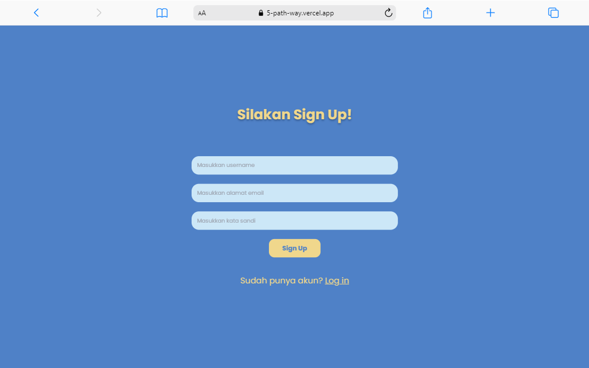
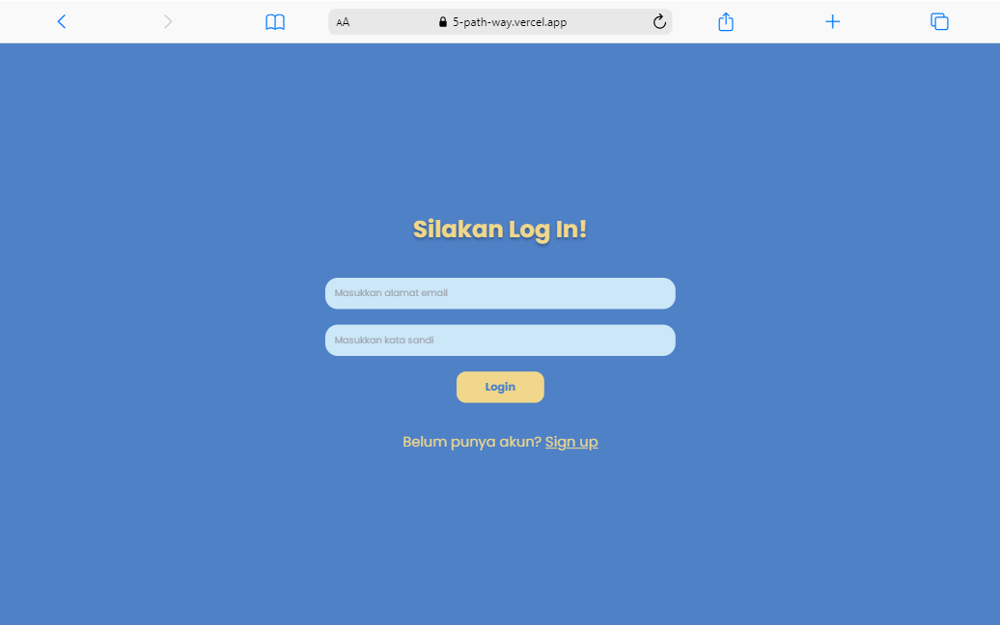
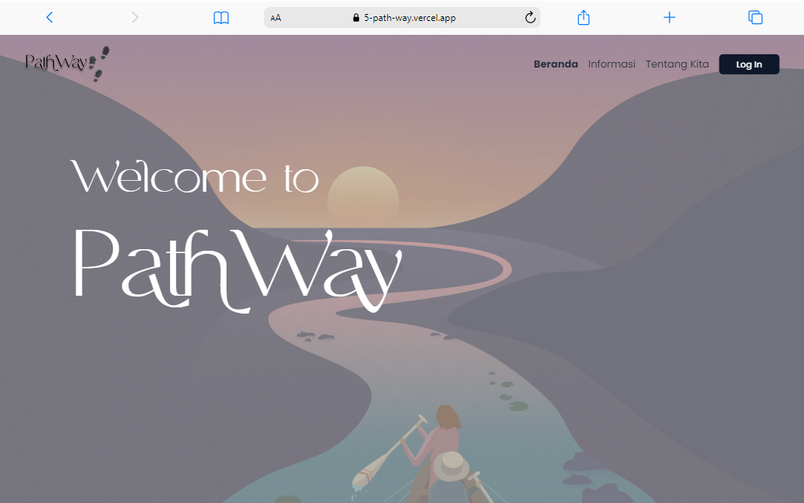
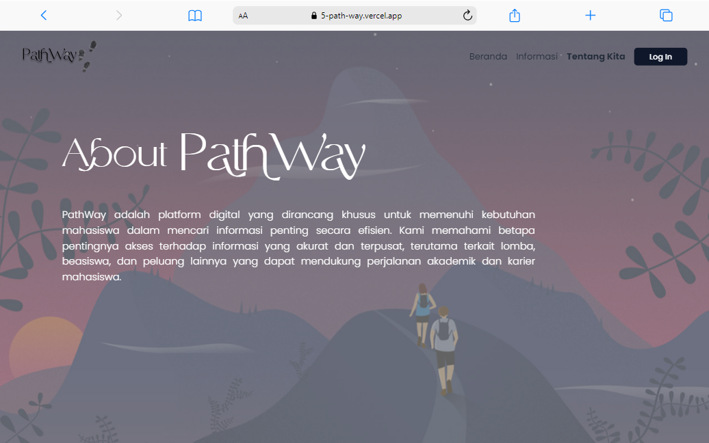
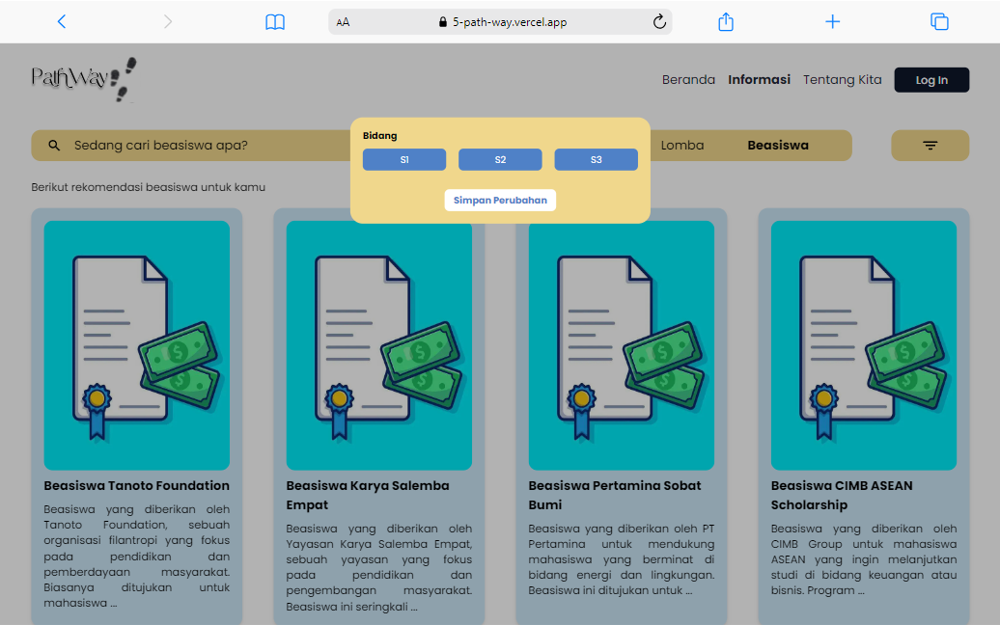
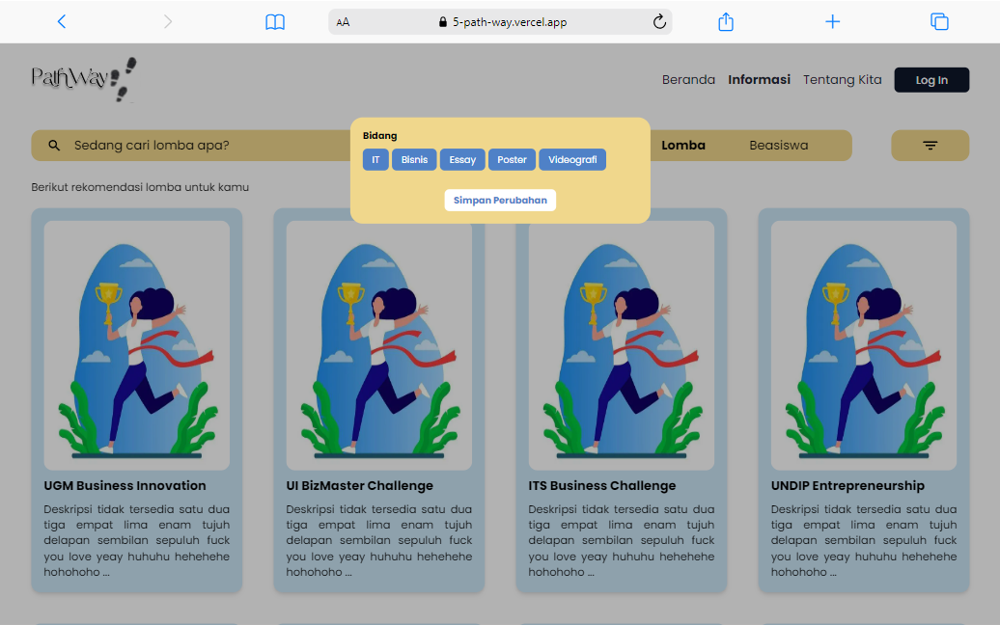
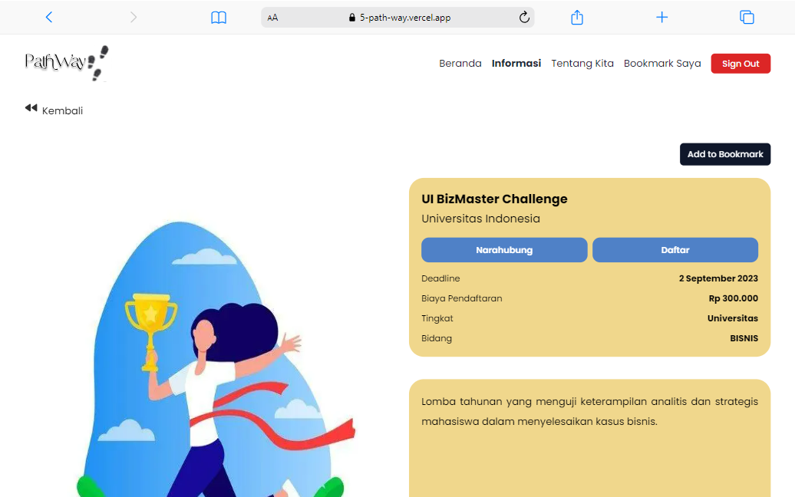
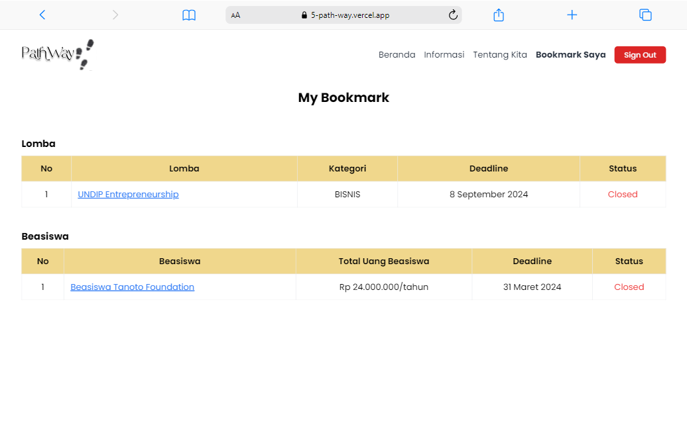

<h1 align="center">PathWay</h1>
<h3 align="center">Scholarship and Competition Information Platform</h3>

## Table of Contents

- [Description](#description)
- [Framework and Tools Used](#framework-and-tools-used)
- [Structure](#structure)
- [How To Run](#how-to-run)
- [Contributors](#contributors)
- [References](#references)

## Description

PathWay adalah platform digital yang dirancang khusus untuk memenuhi kebutuhan mahasiswa dalam mencari informasi penting secara efisien. Kami memahami betapa pentingnya akses terhadap informasi yang akurat dan terpusat, terutama terkait lomba, beasiswa, dan peluang lainnya yang dapat mendukung perjalanan akademik dan karier mahasiswa.

## Our Design

You can view our product design here: [UI/UX PathWay](https://www.figma.com/design/kMmKd0qZefcR8vuVvpLIkq/Milestone-SPARTA?node-id=0-1&t=Rh7239TIMCCG2krN-1)

## Framework and Tools Used

- **Next.js**: a react framework for building full-stack web applications.
- **Tailwind CSS**: a utility-first CSS framework for rapidly designing custom user interfaces.
- **Typescript**: a strongly typed programming language that builds on JavaScript, giving you better tooling at any scale.
- **Shadcn/ui**: a collection of re-usable components that you can copy and paste into your apps.
- **NextAuth.js** : an open source library that provides easy and flexible authentication for Next.js applications.
- **Prisma** : a modern ORM for Node.js and TypeScript that simplifies database interaction with type-safe queries and data modeling
- **Neon** : a cloud-native database service that delivers Postgres reliability, performance, and extensibility as a serverless product.

## Structure

- Auth
  - Sign Up : Memungkinkan pengguna baru untuk mendaftar dan membuat akun di platform.
    
  - Login : Memungkinkan pengguna yang telah terdaftar untuk masuk ke akun mereka dengan menggunakan kredensial yang benar, seperti email dan kata sandi.
    
- Beranda : Halaman utama dari sebuah situs web kami yang berfungsi sebagai pintu masuk utama bagi pengguna untuk menavigasi ke bagian-bagian lain.
  
- Tentang Kita : Menyediakan informasi mengenai platform
  
- Informasi
  - Beasiswa : Berisikan informasi beasiswa yang ada, dengan filter pencarian berdasarkan tingkat yang bertujuan untuk memudahkan user.
    
  - Lomba : Berisikan informasi lomba yang ada, dengan filter pencarian berdasarkan bidang/kategori yang bertujuan untuk memudahkan user.
    
- Bookmark Saya : Fitur yang memungkinkan pengguna menyimpan dan mengelola lomba atau beasiswa favorit mereka untuk diakses kembali dengan mudah.
  
  

## How To Run

To access this website, you can just simply go to:
https://5-path-way.vercel.app/

To run it locally:

1. **Clone this repository:**
   ```bash
   git clone https://github.com/carllix/5_PathWay.git
   ```
2. **Navigate to the src directory of the program by running the following command in the terminal:**
   ```bash
   cd 5_PathWay
   ```
3. **Create and setup .env file**
4. **Install dependencies:**
   ```bash
   npm install
   ```
5. **Run the development server:**
   ```bash
   npm run dev
   ```
   Access the application via `http://localhost:3000` in your web browser.

## Contributors

| **NAMA**                    | **NIM**  | **ROLE**                       |
| --------------------------- | -------- | ------------------------------ |
| Nathan Priandi Lesmana      | 19623274 | Product Manager                |
| Lidya Marthadilla           | 19623089 | Product Manager                |
| Darren Mansyl               | 19623168 | Software Engineer (Front End)  |
| Faqih Muhammad Syuhada      | 19623083 | Software Engineer (Front End)  |
| Raka Daffa Iftikhaar        | 19623249 | Software Engineer (Front End)  |
| Carlo Angkisan              | 19623005 | Software Engineer (Full Stack) |
| Danendra Shafi Athallah     | 19623016 | Data Science                   |
| Muhammad Azizdzaki K.       | 19623246 | Data Science                   |
| Naila Selvira Budiana       | 19623067 | Data Science                   |
| Muhammad Aditya Rahmadeni   | 19623224 | Software Engineer (Front End)  |
| Fhatika Adhalisman Ryanjani | 19623138 | UI/UX                          |

## References

- Next.js: https://nextjs.org/
- Tailwind CSS: https://tailwindcss.com/
- Shadcn/ui: https://ui.shadcn.com/
- Prisma: https://www.prisma.io/
- NextAuth.js: https://next-auth.js.org/
